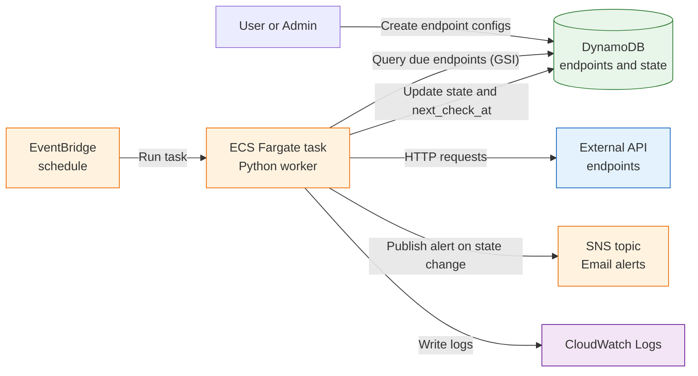
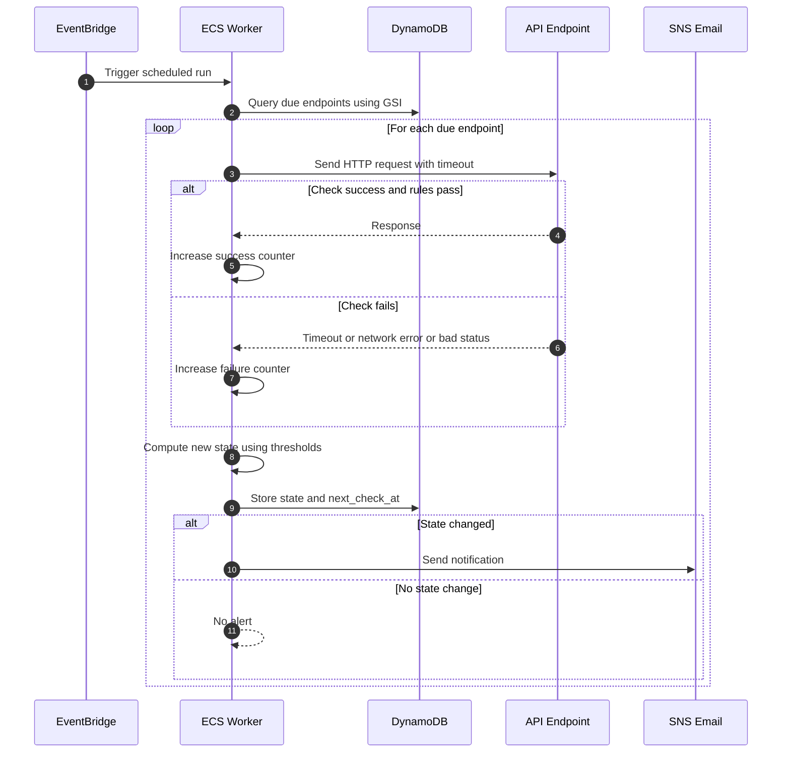
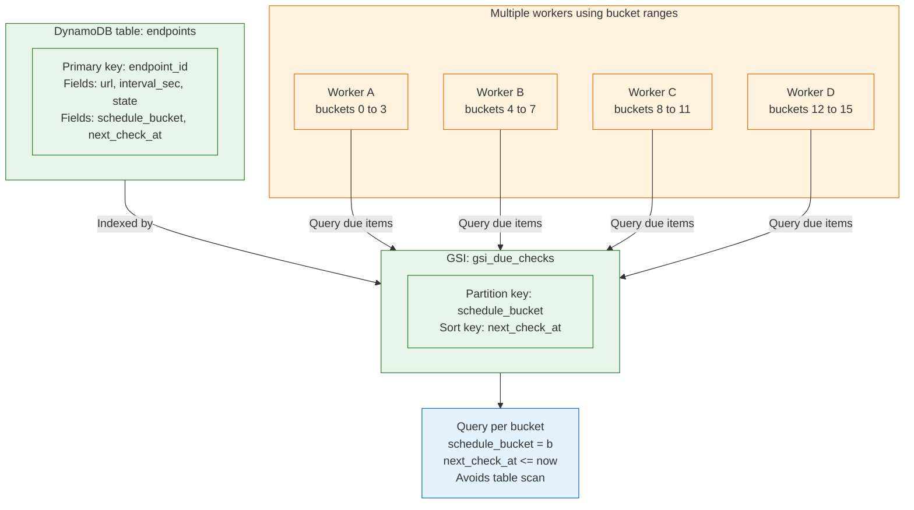

---

# API Health Monitoring System

---

## 1. Overview

This project implements a **self-hosted API health monitoring system** that periodically checks the health of user-defined API endpoints and notifies users when **meaningful health state changes** occur.

The system is designed with a strong focus on:

* scalability
* reliability
* operational correctness
* infrastructure-as-code (Terraform)

No third-party or managed monitoring tools are used.

---

## 2. Key Features

* Configurable API endpoints (URL, interval, timeout, expected status)
* Real HTTP-based health checks
* Failure and recovery thresholds to avoid alert spam
* State-change–based notifications (no repeated alerts)
* Scalable scheduling using DynamoDB GSI
* Horizontal scaling via bucket partitioning
* AWS-native deployment using Terraform

---

## 3. High-Level Architecture



**Description**
A scheduled EventBridge rule triggers a containerized worker running on ECS Fargate.
The worker queries DynamoDB for due endpoints, performs health checks, persists state, and sends alerts via SNS.

---

## 4. Health Check & Alerting Flow



**Key Principle**
Alerts are emitted **only when the state changes**:

* HEALTHY → UNHEALTHY
* UNHEALTHY → HEALTHY

This prevents repeated notifications during continuous failures.

---

## 5. DynamoDB Data Model

### Primary Table: `endpoints`

| Attribute       | Purpose                  |
| --------------- | ------------------------ |
| endpoint_id     | Primary key              |
| url             | API endpoint             |
| interval_sec    | Check frequency          |
| state           | HEALTHY / UNHEALTHY      |
| consec_fail     | Consecutive failures     |
| consec_succ     | Consecutive successes    |
| schedule_bucket | Partition bucket         |
| next_check_at   | Next eligible check time |
| enabled         | Soft disable flag        |

---

## 6. Scalable Scheduling Design



**Why this scales**

* No full table scans
* Efficient `Query` using GSI
* Horizontal scaling by adding workers
* No duplicate checks when bucket ranges don’t overlap

---

## 7. Health Evaluation Logic

An endpoint is marked **unhealthy** if:

* Request times out
* Network or DNS error occurs
* HTTP status code is unexpected
* Latency exceeds threshold (optional)
* Response body validation fails (optional)

State transitions are controlled by:

* `failure_threshold`
* `recovery_threshold`

---

## 8. Handling Missed Schedules

If a worker runs late or is temporarily unavailable:

* Endpoints with `next_check_at <= now` are still picked up
* Only one check is performed (no backlog storm)
* `next_check_at` is rescheduled relative to current time

This ensures eventual consistency without overloading the system.

---

## 9. Notifications

* Implemented using **Amazon SNS (Email)**
* Alert sent only on state transitions
* Continuous failures do **not** trigger repeated emails

---

## 10. Infrastructure & Security

### AWS Services Used

* ECS Fargate (compute)
* DynamoDB (state storage)
* EventBridge (scheduler)
* SNS (notifications)
* CloudWatch Logs (observability)

### Security Principles

* Least-privilege IAM roles
* No hardcoded credentials
* Scoped access to specific resources

---

## 11. Deployment Instructions

### Prerequisites

* AWS account (Free Tier sufficient)
* AWS CLI configured
* Terraform
* Docker

### Deploy Infrastructure

```
cd terraform
terraform init
terraform apply -var="sns_email=you@example.com"
```

Confirm SNS email subscription when prompted.

### Build & Push Docker Image

```
docker build -t api-health-monitor ./app
docker tag api-health-monitor:latest <ECR_URL>:latest
docker push <ECR_URL>:latest
```

---

## 12. Trade-offs & Assumptions

* Default VPC used for simplicity
* Best-effort scheduling (not real-time guarantees)
* No UI provided (focus on backend & infra)
* Bucket partitioning preferred over locking for simplicity

---

## 13. Future Improvements

* SQS-based work queue for very large scale
* Webhook or Slack notifications
* Dashboard for health history
* Alert cooldown and escalation policies
* Per-endpoint SLA tracking

---

## 14. Conclusion

This system demonstrates a **production-oriented approach** to API health monitoring, emphasizing:

* scalability
* reliability
* operational clarity
* thoughtful infrastructure design

The solution prioritizes **engineering judgment over feature completeness**, in line with the assignment goals.

---
